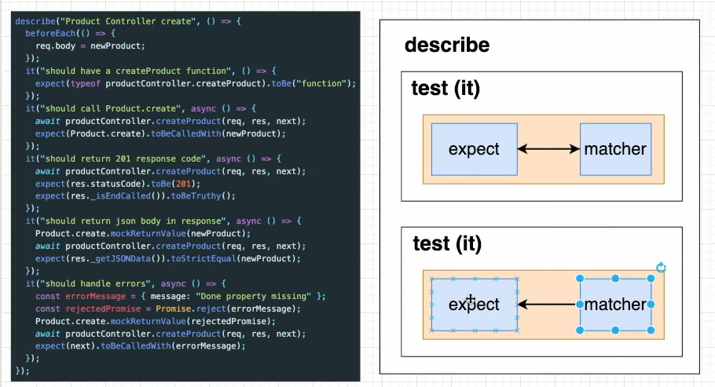
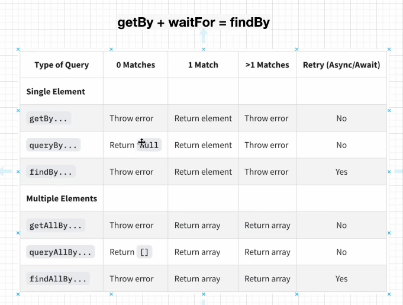

# Test Driven Development (TDD)

- 실제 코드를 작성하기 전, 테스트 코드를 먼저 작성

- 테스트 코드를 작성한 후 그 테스트 코드를 Pass 할 수 있는 실제 코드를 작

성

### 좋은점

1. 많은 기능을 테스트하므로 소스 코드에 안정감이 부여된다.

2. 실제 개발하면서 많은 시간이 소요되는 부분 => **디버깅**
   
   TDD를 이용하면 디버깅 시간이 줄어들고, 실제 개발 시간도 줄어든다.

3. 깨끗한 코드가 나올 확률이 높다.

## React Testing Library

공식문서 : [React Testing Library](https://testing-library.com/docs/react-testing-library/intro/)

- `React Testing Library`는 react 구성 요소 작업을 위한 **API**를 추가하여 **DOM testing library 위에 구축**된다.

- `DOM Testing Library`는 DOM node를 테스트하기 위한 매우 **가벼운 솔루션**이다.

- create-react-app 으로 프로젝트 생성 시, 즉시 React Testing Library를 지원한다.
  
  지원하지 않아도, npm을 통해 설치 가능
  
  👉 `npm install --save-dev @testing-library/react`

### Enzyme vs React Testing Library

**Enzyme**

- 에어비앤비 개발

- 구성 요소의 **구현 세부 정보**를 테스트

- **구현 주도 테스트** (Implementation Driven Test)

**React Testing Library**

- 개발자를 React **애플리케이션의 사용자 입장**에 둔다

- **행위 주도 테스트** (Behavior Driven Test)

## JEST

- Facebook 에서 만든 **테스팅 프레임워크**

- React Testing Library와 함께 사용하여 리액트 어플리케이션을 테스트한다.

- 최소한의 설정으로 동작, **Test Case**를 만들어서 어플리케이션 코드가 잘 돌아가는지 확인

- **단위(Unit) 테스트**를 위해 이용

### JEST 사용하기

※ create-react-app으로 프로젝트 생성 시 기본으로 설치되어 있다.

1. 라이브러리 설치하기 : `npm install jest --save-dev`

2. Test 스크립트 변경 : `"test" : "jest"` 혹은 `"jest--watchAll"`

3. 테스트 작성 할 폴더 및 파일 기본 구조 생성
   
   단위 테스트 폴더(**Unit Test**) : `<대상 이름>.test.js`
   
   통합 테스트(**Intergration Test**) : `<대상 이름>.test.init.js`
   
   => JEST가 해당 테스트 파일을 찾는다.

### JEST 파일 구조 및 사용법



**describe**

- `describe(name, fn)`

- 여러 관련 테스트를 그룹화하는 블록 생성

**it**

- `it(name, fn, timeout)`

- 개별 테스트를 수행하는 곳

- 각 테스트를 작은 문장처럼 설명한다

- `expect`와 `matcher`
  
  - **expect**
    
    - 함수 값을 **테스트할 때마다** 사용된다.
    
    - `matcher`와 함께 사용된다, 혼자서는 거의 사용되지 않음
  
  - **matcher**
    
    - 다른 방법으로 값을 테스트하도록 사용
    
    - `toBe()`, `toBeCalledWith()`, `toBeTruthy()`, `toStrictEqual()` 등...

## React Testing Library 주요 API

- `a` : 전체 테스트

- `q` : quit, 종료

- **JEST** 는 `.test.js`, `.spec.js`, 혹은 `test 폴더` 안의 파일 등을 알아서 찾아 테스트 진행.
  
  ```javascript
  test('renders learn react link', () => {
    render(<App />);
    const linkElement = screen.getByText(/learn react/i);
    expect(linkElement).toBeInTheDocument();
  });
  ```
  
  - `App` 컴포넌트 안에 "learn react" 라는 문자열이 존재하는지 테스트하는 함수
  
  - 하단의 코드도 같은 내용이다.
  
  ```javascript
  test('renders learn react link', () => {
    const { getByText } = render(<App />);
    const linkElement = getByText(/learn react/i);
    expect(linkElement).toBeInTheDocument();
  });
  ```
  
  - 단, 해당 코드는 소스 코드가 복잡해지면 **비추천**한다.
  
  - 사용해야 할 **쿼리가 많아지므로** 코드가 복잡해질 수 있기 때문이다.
  
  - => `screen 객체`를 사용하자.


### 쿼리 함수

- 페이지에서 요소를 찾기 위해 테스트 라이브러리가 제공하는 방법

- 여러 유형의 쿼리가 존재 (`get`, `find`, `query`)
  
  - 공통점은, **쿼리에 대해 일치하는 노드를 반환**하는 것.
  
  - 차이점은 요소가 없을 때 오류를 발생하는지, Promise를 반환하는지.
  
  - **getBy**
    
    - 일치하는 요소가 있으면 해당 **노드 반환**
    
    - 일치하는 요소가 없거나, 둘 이상일 시 **오류**를 발생
      
      - 둘 이상일 경우엔, `getAllBy` 사용
  
  - **queryBy**
    
    - 일치하는 요소가 있으면 해당 노드 반환****
    
    - 일치하는 요소가 없으면 **null 반환**
    
    - 둘 이상의 일치 항목이 발견되면 오류 발생
      
      - `queryAllBy` 사용
  
  - **findBy**
    
    - 일치하는 요소가 **발견되면 Promise**를 반환.
    
    - 일치하는 요소가 없거나, <u>1000ms 이후(waitFor)</u> 둘 이상의 요소가 발견되면 **Promise 거부**
      
      - 둘 이상의 요소를 사용할 경우 `findAllBy` 사용




## Prettier

- 테스팅 할 때, matcher를 알맞게 쓰는지 확신이 들지 않을 때

- 코드의 형식이나 자바스크립트 문법 등을 올바르게 쓰지 못할 때

... 를 도와주는 모듈 (**Prettier**, **ESLint**)

 

- code formatter 역할, **코드 형식**을 맞추는 데 사용.

- 에러를 잡는 역할이 아님!


## ESLint

- 개발자들이 **특정한 규칙**을 가지고, 코드를 깔끔하게 짤 수 있게 도와주는 라이브러리

- 자바스크립트를 쓰는 **가이드라인 제시**

- 문법에 오류가 나면 알려주는 역할

- eslint 설정 파일 : `.eslintrc.json`
  
  - `package.json` 파일의 **"eslintConfig"** 부분을 복사해, `.eslintrc.json` 파일에 json 형식으로 붙여넣기.

### ESLint Testing Plugins 설치하기

- **plugins?**
  
  - eslint에서 기본으로 제공하지 않는 **다양한 규칙**을 플러그인을 통해 사용할 수 있음
  
  - ex) **react**와 관련된 eslint 설정 => `eslint-plugin-react`
    
    **react hooks**에 관련된 규칙 => `eslint-plugin-react-hooks`

- `npm install eslint-plugin-testing-library eslint-plugin-jest-dom`
  
  - **testing-library** : render로 Dom을 그리는 부분
  
  - **jest-dom** : expect-matcher로 테스트

- 설치한 부분을 `.eslintrc.json` 파일에 추가 설정
  
  ```json
  {
    "plugins": [
      "testing-library",
      "jㄷt-dom"
    ],
    "extends": [
      "react-app",
      "react-app/jest",
      "plugin:testing-library/react",
      "plugin:jest-dom/recommended"
    ]
  }
  ```
  
  - `"plugins"` 내부 작성 시, eslint-plugin 생략
  
  - `"extends"` 플러그인을 추가한 후 규칙을 정해줘야 사용 가능함.
    
    - `/react` : 리액트를 위한 규칙
    
    - `/recommended` : 추천이 되는 걸 사용
